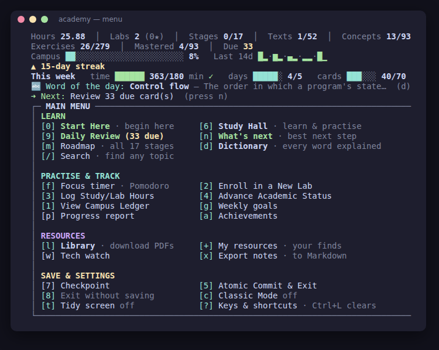

# learning_space

## Systems & AI Academy

A terminal study companion for self-learners. It covers the core of a computer science degree plus modern AI in 17 stages, starting from how computers work and C. It includes spaced repetition, real exercises, a programmer's dictionary, a PDF library and tech watch, all in one dependency-free executable.

- **Download:** [Releases](https://github.com/pronexuscodex/learning_space/releases), for Linux, macOS, Windows and FreeBSD.
- **Read more:** [academy/README.md](academy/README.md).
- **What's new:** [academy/CHANGELOG.md](academy/CHANGELOG.md).

