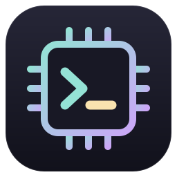
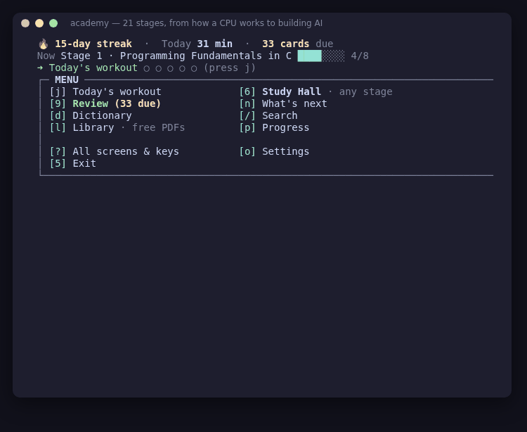
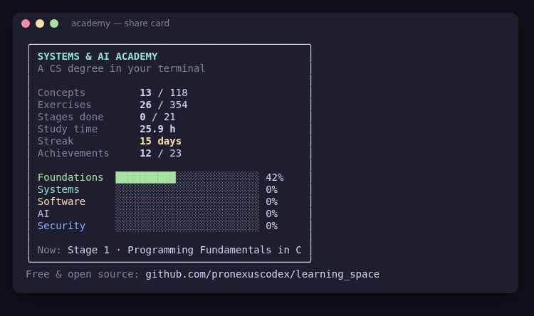
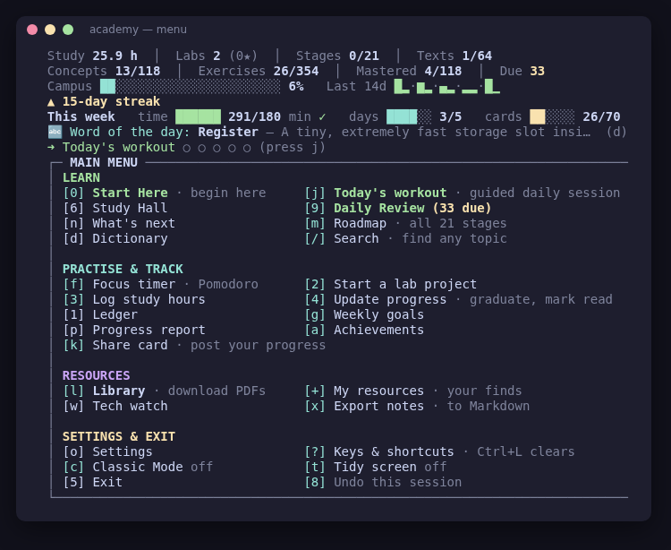

<p align="center"></p>

<h1 align="center">Systems & AI Academy</h1>

<p align="center"><b>A free computer science degree that runs in your terminal.</b><br>
21 stages, from how a CPU works and C to operating systems, security and building AI,<br>
with real exercises, quizzes and spaced repetition so you keep what you learn.</p>

<p align="center">
  <a href="https://github.com/pronexuscodex/learning_space/releases/latest"></a>
  <a href="https://github.com/pronexuscodex/learning_space/actions/workflows/ci.yml"></a>
  <a href="LICENSE"></a>
  
  <a href="https://github.com/pronexuscodex/learning_space/stargazers"></a>
</p>

<p align="center"></p>

## Install in one command

No account, no administrator rights, nothing to configure. It adds the app, with its icon, to your Start Menu, Launchpad or applications menu.

**Windows** (PowerShell)

```powershell
irm https://raw.githubusercontent.com/pronexuscodex/learning_space/main/install.ps1 | iex
```

**macOS and Linux** (Terminal)

```sh
curl -fsSL https://raw.githubusercontent.com/pronexuscodex/learning_space/main/install.sh | sh
```

Then open **Systems & AI Academy**, or type `academy`. You can also use [Homebrew, Scoop or a direct download](academy/README.md#install).

## What's inside

| | |
|---|---|
| 🧭 **A real curriculum** | 21 stages in five tracks (Foundations, Systems, Software & Theory, AI & Hardware, Defensive Security), in the order a CS degree teaches them. |
| 💡 **118 concepts** | Each one comes with an analogy, a real-world example, a diagram, and a look *under the hood* at the real bytes and commands. |
| 🛠️ **354 exercises** | Hands-on, three per concept, plus quizzes, mastery checks, lab blueprints and type-in programs. |
| 🧠 **Spaced repetition** | Daily review brings back each idea just before you'd forget it. |
| 📖 **281-word dictionary** | Every programming word explained in plain language, with related words. |
| 📚 **Library** | 33 free, legal books and papers that download as PDFs into `Documents/Academy Library`, arranged by stage. |
| 📰 **Tech watch** | Headlines from 19 hand-picked feeds, such as arXiv, LWN and Krebs, and your own radar of trends. |
| 🧭 **Think first** | A guided daily workout, a hint ladder that points you to the docs before the answer, an honest solve log with redo-from-scratch, blank-page recall and confidence calibration. They build skill you keep without leaning on AI. |
| 🎨 **Comfortable to use** | Colour themes, including high contrast and colour-blind friendly, plain symbols for any terminal, and layouts that work from 40 columns up. |
| 🔥 **Streaks, goals, achievements** | And a **share card** to post your progress (`k` in the app). |

Everything runs offline and stays on your computer, apart from the optional downloads. It's one small program with no dependencies, written in Go.

## Share your progress

Press **`k`** in the app, or run `academy -card`, then take a screenshot and post it with **#LearnInPublic**.

<p align="center"></p>

## Contribute

Found a better free resource, a clearer explanation, a typo or a bug? Contributions of every size are welcome. Start with [CONTRIBUTING.md](CONTRIBUTING.md) and look for issues labelled [`good first issue`](https://github.com/pronexuscodex/learning_space/labels/good%20first%20issue).

If the academy helps you, **star the repository**. It helps other self-learners find it.

## Learn more

- [Full guide](academy/README.md): every screen, the curriculum stage by stage, keys, data safety and how it is built.
- [What's new](academy/CHANGELOG.md)
- [License: MIT](LICENSE)


