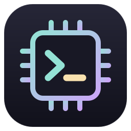
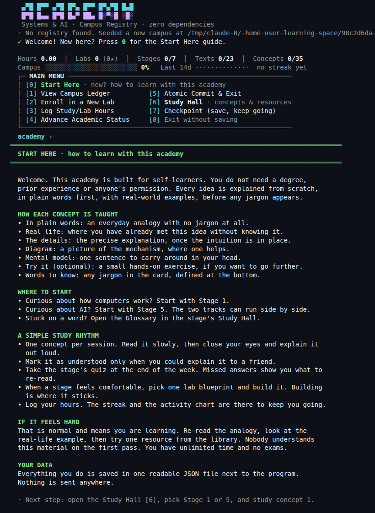
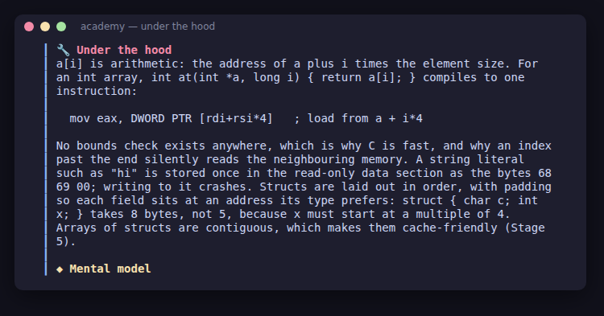
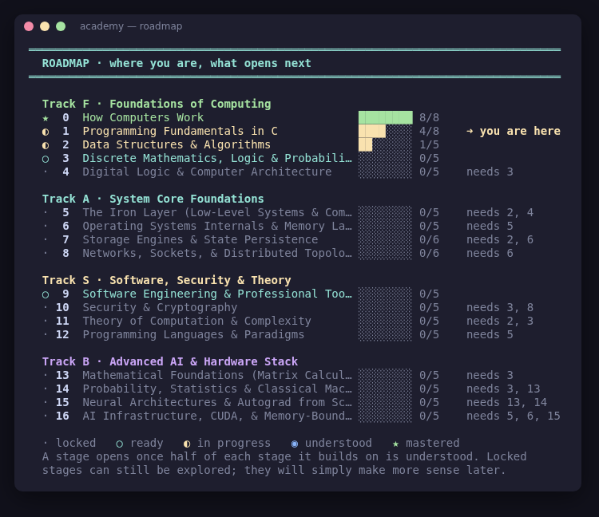
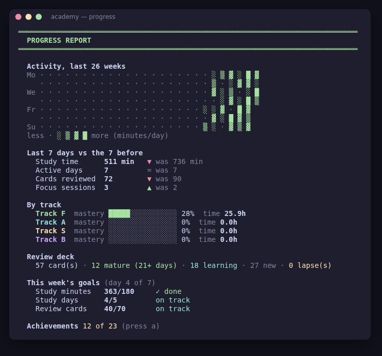
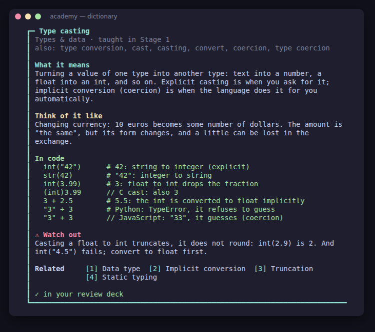
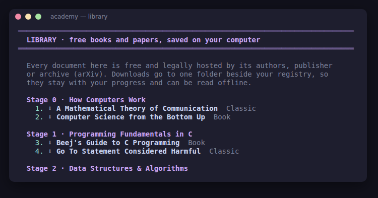
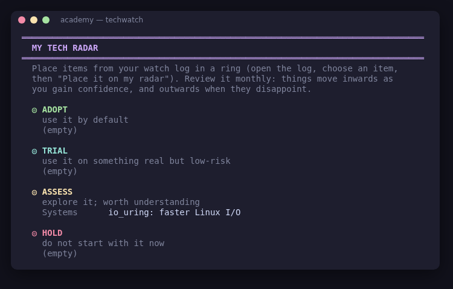

<p align="center"></p>

# Systems & AI Academy: Campus Registry

A terminal-based study companion for **self-learners**. It covers the core of a computer science degree plus modern AI in **17 stages**, starting with how computers work, and it assumes no prior knowledge. Every concept is explained from scratch and comes with **real-world exercises**.

It is written in Go, uses only the standard library, and keeps all your progress in one readable JSON file.

New here? Build it (below), run it, and press **`0`** for the *Start Here* guide. The path starts at **Stage 0, How Computers Work**, then **Stage 1, C**.

## Contents

- [Install](#install)
- [The curriculum](#the-curriculum)
- [How computers work (Stage 0)](#how-computers-work-stage-0)
- [C first: see what is under the hood](#c-first-see-what-is-under-the-hood)
- [How each concept is taught](#how-each-concept-is-taught)
- [Exercises](#exercises)
- [Built to be remembered, not just read](#built-to-be-remembered-not-just-read)
- [Menu](#menu)
- [Study Hall](#study-hall)
- [Programmer's dictionary](#programmers-dictionary)
- [Library: PDFs without leaving the academy](#library-pdfs-without-leaving-the-academy)
- [Your own resources](#your-own-resources)
- [Tech watch: keeping up with the field](#tech-watch-keeping-up-with-the-field)
- [Classic Mode: learn like it's 1985](#classic-mode-learn-like-its-1985)
- [Accurate resources](#accurate-resources)
- [Keyboard](#keyboard)
- [Resizing the terminal](#resizing-the-terminal)
- [Colours](#colours)
- [Data safety](#data-safety)
- [Schema (abridged)](#schema-abridged)
- [Tests](#tests)
- [Source layout](#source-layout)
- [Releasing](#releasing)

## Install

### With a package manager (from version 1.1.0)

**macOS and Linux, with [Homebrew](https://brew.sh):**

```sh
brew tap pronexuscodex/academy https://github.com/pronexuscodex/learning_space
brew install pronexuscodex/academy/academy
```

**Windows, with [Scoop](https://scoop.sh):**

```powershell
scoop bucket add academy https://github.com/pronexuscodex/learning_space
scoop install academy/academy
```

Then run `academy`. Update later with `brew upgrade academy` or `scoop update academy`. Package-manager installs usually avoid the unknown-developer warnings described below, and they keep your progress in a per-user folder that upgrades never touch (see [Where your progress lives](#where-your-progress-lives)).

### Download a release (no Go needed)

1. Download the archive for your system from the [Releases page](https://github.com/pronexuscodex/learning_space/releases):

   | System | File |
   |--------|------|
   | Linux (most PCs) | `academy-vX.Y.Z-linux-amd64.tar.gz` |
   | Linux (Raspberry Pi 4/5, ARM servers) | `academy-vX.Y.Z-linux-arm64.tar.gz` |
   | macOS (Apple silicon: M1 and later) | `academy-vX.Y.Z-darwin-arm64.tar.gz` |
   | macOS (Intel) | `academy-vX.Y.Z-darwin-amd64.tar.gz` |
   | Windows (most PCs) | `academy-vX.Y.Z-windows-amd64.zip` |
   | Windows on ARM | `academy-vX.Y.Z-windows-arm64.zip` |
   | FreeBSD | `academy-vX.Y.Z-freebsd-amd64.tar.gz` |

2. Optionally check that the download is intact against `SHA256SUMS`:

   ```sh
   sha256sum -c SHA256SUMS --ignore-missing           # Linux
   shasum -a 256 -c SHA256SUMS --ignore-missing       # macOS
   ```

   On Windows, run `Get-FileHash academy-*.zip` in PowerShell and compare the result with the line in `SHA256SUMS`.

   From version 1.1.0 you can also check who built it. Every archive has a signed build-provenance attestation, which proves that the release workflow built it from this repository's code:

   ```sh
   gh attestation verify academy-v1.1.0-linux-amd64.tar.gz --repo pronexuscodex/learning_space
   ```

3. Unpack it and run it from a terminal:

   ```sh
   tar -xzf academy-*-linux-amd64.tar.gz
   cd academy-*-linux-amd64
   ./academy
   ```

   On Windows, unzip it, open the folder, and run `academy.exe` from Windows Terminal or PowerShell.

The executables are not code-signed, so the first launch may show a warning:
- **macOS** says it "cannot verify the developer". Either right-click the file in Finder, choose **Open**, and confirm, or run `xattr -d com.apple.quarantine ./academy` once.
- **Windows** SmartScreen may say it "protected your PC". Choose **More info**, then **Run anyway**.

Everything runs locally and offline, apart from the optional Library downloads, tech-watch headlines and `-check-links`. Nothing is sent anywhere.

### Build from source

```sh
cd academy
go build -trimpath -ldflags="-s -w" -o academy .      # Linux / macOS
go build -trimpath -ldflags="-s -w" -o academy.exe .  # Windows
./academy
```

It needs Go 1.22 or later, and nothing else: there are no dependencies to download. Run `./academy -version` to see what you have, and `./academy -h` for every flag.

### Where your progress lives

Your progress is one file, `academy_campus_registry.json`. Backups, downloaded PDFs and exports go in the same folder. The program creates the file on first run, in this folder:

| How you run it | Folder |
|---|---|
| `-registry path/to/file.json` | the folder of that file |
| `ACADEMY_HOME` is set | `$ACADEMY_HOME` |
| Installed with Homebrew on macOS | `~/Library/Application Support/academy` |
| Installed with Homebrew on Linux | `~/.local/share/academy` (or `$XDG_DATA_HOME/academy`) |
| Installed with Scoop or winget | `%LocalAppData%\academy` |
| A downloaded or self-built binary | next to the binary |
| `go run .` | the current directory, because the temporary build folder would be deleted |

Package managers replace their install folder on every upgrade, which is why those installs keep your data elsewhere. To move from a downloaded copy to a package-manager install, move your registry and its folders into the new location, or set `ACADEMY_HOME` to the old folder.

Other flags: `-no-color`, `-check-links` (verify every resource URL), `-backups` (list automatic backups), `-restore N` (restore one) and `-fetch-library` (download every PDF in the Library for offline study).

**Upgrading from the 7-stage version:** your existing registry file is migrated automatically. The original stages move to their new numbers (1→5, 2→6, 3→7, 4→8, 5→13, 6→15, 7→16), your labs, hours, readings and concept progress are kept, and the nine new stages are added. Commit once to save the upgraded file.

## The curriculum

| Track | Stage | Topic |
|-------|-------|-------|
| **F · Foundations** | 0 | **How Computers Work**: the whole machine, before any code |
| | 1 | Programming Fundamentals **in C** |
| | 2 | Data Structures & Algorithms |
| | 3 | Discrete Mathematics, Logic & Probability |
| | 4 | Digital Logic & Computer Architecture |
| **A · Systems** | 5 | The Iron Layer: compilers & the machine |
| | 6 | Operating Systems Internals & Memory |
| | 7 | Storage Engines, Databases & SQL |
| | 8 | Networks, the Web & Distributed Systems |
| **S · Software, Security & Theory** | 9 | Software Engineering & Professional Tools |
| | 10 | Security & Cryptography |
| | 11 | Theory of Computation & Complexity |
| | 12 | Programming Languages & Paradigms |
| **B · AI** | 13 | Mathematical Foundations: linear algebra & matrix calculus |
| | 14 | Probability, Statistics & Classical ML |
| | 15 | Neural Networks & Autograd from Scratch |
| | 16 | AI Infrastructure, CUDA & Inference |

That is **93 concepts** and **279 exercises**, plus a glossary, a resource library, lab blueprints, a quiz and a mastery check for every stage. Start Here also lists electives for afterwards: graphics, quantum computing, embedded systems and bioinformatics.

## How computers work (Stage 0)

The academy starts before programming, with a guided tour of the whole machine, so that everything later has somewhere to fit. Stage 0's eight concepts:

1. **Bits & Bytes: Everything Is a Number**: binary, hex, and how text, colours, images, sound and programs are all numbers.
2. **The CPU at Work: Fetch, Decode, Execute**: registers, the ALU, the program counter, the clock, and instruction sets (x86-64, ARM64, RISC-V).
3. **Memory & Storage: Where Data Lives**: RAM versus storage, and the memory hierarchy with real latencies (if an L1 cache hit took a second, a RAM read would take a minute and a half, and a transatlantic round trip about three years).
4. **From Source Code to Running Program**: compilers, executables (ELF, PE, Mach-O), processes, the loader, and system calls, seen with `strace`.
5. **The Operating System: The Machine's Manager**: user and kernel mode, scheduling, virtual memory, files and drivers.
6. **Input & Output: Keys, Screens & Interrupts**: a keypress followed from the key switch to the pixel, plus interrupts, polling and DMA.
7. **Networks: How Computers Talk**: packets, layers, and what happens when you open a web page (DNS, TCP, TLS, HTTP).
8. **Booting: From Power Button to Login**: firmware, boot loader, kernel, process 1, services.

Each concept has the usual analogy, real-life example, diagram and three exercises, plus an **🔧 Under the hood** section with the real bytes and commands. The Classic corner pairs Petzold's *Code* with Shannon's 1948 paper that defined the bit, and the LC-3 virtual machine tutorial. The type-in is a **tiny CPU simulated in C**: you predict what it prints and trace its fetch–decode–execute steps by hand. *Computer Science from the Bottom Up* is in the Library as a free PDF.

Stage 1 (C) builds on it, so a fresh campus starts at Stage 0.



## C first: see what is under the hood

Stage 1 teaches programming **in C**. In C, every value has a size and an address, and the compiler turns your text into real machine instructions, so from the first week you see what other languages do for you behind the scenes. Stage 1 has eight concepts:

1. Your First C Program: Source, Compiler, Executable (including installing gcc or clang, on Linux, macOS, or Windows via WSL)
2. Values, Types & Variables (sizes, integer division, casts, printf formats)
3. Control Flow: Decisions & Loops
4. Functions & Decomposition (prototypes, headers, pass-by-value, the stack)
5. Memory, Addresses & Pointers
6. Collections: arrays, strings with their '\0', and structs
7. Safe Input & Undefined Behavior: fgets and strtol, checking return values, and -fsanitize=address,undefined
8. Debugging & Reading Errors: compiler warnings, gdb, sanitizers

Every Stage 1 concept also has an **🔧 Under the hood** section showing what the machine really does, taken from real gcc output on x86-64:
- `int count = 3;` as a stack slot, and its little-endian bytes;
- a loop as compare-and-jump, and an `if` turned into a conditional move;
- the calling convention (arguments in `rdi` and `rsi`, the result in `eax`);
- `*p` as a single load, and `a[i]` as `[a + i*4]`;
- struct padding;
- the path from `_start` through `__libc_start_main` to `main`, and printf as one `write` system call;
- gcc -O2 deleting an overflow check that relies on undefined behaviour;
- how gdb plants an `int3` breakpoint.

Every exercise is in C. The reading list is K&R, King's *C Programming: A Modern Approach* and Gustedt's free *Modern C*, with *Beej's Guide to C* downloadable in the Library. The Classic corner pairs K&R with antirez's kilo editor and a C type-in.

Why C: it is small, it is what the operating system, databases, language runtimes and firmware underneath everything are written in, and strong universities teach systems in it. Harvard's CS50 switches to C in its first week, and Stanford's CS107, Berkeley's CS61C and CMU's 15-213 teach systems in C. (Many universities start with Python for the very first course and then move to C; the academy goes straight to C for understanding.) C also lets you make mistakes other languages hide, so Stage 1 teaches the defensive habits from day one.

**Existing registries** are updated on load: Stage 1's title changes, the C books are added to its reading list (books you already marked read are kept), and all concept progress, notes and reviews stay as they were. The five original concept names are unchanged, so nothing is lost.



## How each concept is taught

Each concept moves from intuition to precision:

1. **💬 In plain words:** an everyday analogy with no jargon.
2. **🌍 Real life:** where you have already met the idea, such as the Ariane 5 overflow, GTA Online's quadratic loading screen, Kubernetes running on Raft, or the CrowdStrike outage.
3. **🔍 The details:** the precise technical explanation, with a diagram where one helps. Code in explanations keeps its layout.
4. **🔧 Under the hood:** (Stages 0 and 1) what the machine really does: the bytes, the instructions, the system calls.
5. **◆ Mental model:** one sentence to remember.
6. **🏋 Exercises:** three per concept, from easy to real-world (see below).
7. **🔗 Connects to / 📚 Go deeper:** related concepts in other stages, and exactly where to read next.
8. **📝 In your own words:** your explanation, once you have written it.
9. **📖 Words to know / 🔤 Programmer words here:** the stage glossary and dictionary entries for any jargon in the card, listed automatically at the bottom.


## Exercises

Every concept has a ladder of three exercises, and each exercise has a hint:

| Level | What it is | Example (Hash Tables) |
|-------|------------|------------------------|
| ● **Warm-up** | Pen and paper; no code needed | Hash "cat", "act" and "dog" into 5 buckets by hand; why do two of them collide? |
| ● **Practice** | A small program | Build a word counter on your own hash table and race it against the built-in one on a full book |
| ● **Real-world** | A task from a real situation | Find duplicate sign-ups among 1 million shop accounts in roughly O(n) |

The **Exercise Gym** in each stage's Study Hall shows the exercises, reveals hints only when you ask, and lets you tick exercises off. Your progress is saved (`exercises_done`) and shown in the ledger, and it counts towards overall campus progress.


## Built to be remembered, not just read

Reading something once is not learning it. The academy builds in five techniques that research on memory consistently supports:

| Technique | How the academy uses it |
|-----------|-------------------------|
| **Retrieval practice** | **Daily Review** (menu `9`) asks questions instead of showing answers. You try to answer, reveal, then grade yourself: forgot / hard / good / easy. |
| **Spaced repetition** | Each card is rescheduled with an SM-2 style algorithm: 1 day, then 3 days, then roughly a week, then weeks and months. Forgotten cards return in the same session and restart their interval. |
| **Interleaving** | Reviews and mastery checks shuffle cards across concepts and stages. |
| **Your own words** (the Feynman technique) | Marking a concept as understood asks you to explain it in your own words. Your explanation is shown back to you on the concept card and next to its key-idea review card. |
| **Elaboration & connections** | Every concept links to related concepts in other stages, and every stage shows what it builds on. |

Each understood concept adds **three review cards** to your deck: its key idea, a real-life example, and its warm-up exercise. Once half of a stage's concepts are understood, the stage's quiz questions join the deck too. All answers come straight from the curriculum.

**The mastery ladder:** each concept climbs ○ new → ◔ understood → ◑ practised (2 exercises) → ◕ retained (every card remembered at a spacing of 7+ days) → ● **mastered** (all 3 exercises done, and every card remembered at a spacing of 21+ days). "Mastered" cannot be reached in a single day; it measures what you still know weeks later. Campus progress is weighted by mastery.

**The Mastery Check:** each stage has a 12-question interleaved exam drawn from all of its cards, and you pass at 80%. The result is recorded, and graduating a stage warns you if you have not passed it.


## Menu

The menu is grouped into four sections. Keys never change, whatever the layout: wide terminals show two or three columns with hints, and narrow ones show two compact columns.

**Learn**

| Key | Action |
|---|--------|
| 0 | **Start Here**: what the academy covers, how memory works, how to practise, where to begin and a study rhythm |
| 6 | **Study Hall**: concepts, exercise gym, glossary, resources, lab blueprints, quiz and mastery check |
| 9 | **Daily Review**: your due spaced-repetition cards, interleaved across stages (`r` works too) |
| n | **What's next**: up to four recommended steps (due reviews, next concept, an open exercise, a ready mastery check or type-in, a focus session) and one key to start any of them |
| m | **Roadmap**: all 17 stages by track, each marked locked · ready · in progress · understood · mastered, with concept progress, "you are here", and which stages a locked one still needs; open any stage's Study Hall from it |
| d | **Programmer's dictionary**: 270+ jargon words explained plainly (see below) |
| / | **Search** (also `s`): every concept, glossary term, resource, blueprint and classic; all words must match, titles rank first; open a hit directly |

**Practise & track**

| Key | Action |
|---|--------|
| f | **Focus timer**: a live countdown (`p` pause, `s` stop, bell when done) logged as a study session under a stage |
| 2 | **Enroll in a New Lab**: pick a track (`F`/`A`/`S`/`B`), a stage, then a name, notes and initial hours |
| 3 | **Log Study/Lab Hours**: add hours (`1.5`, `1h30m`, `45m`) with an optional note |
| 4 | **Advance Academic Status**: graduate stages or labs, mark literature as read, set compilation status |
| 1 | **View Campus Ledger**: a colour card per stage, with reading, concept and exercise progress bars, labs and hours |
| g | **Weekly goals**: study minutes, study days and review cards per week (Monday to Sunday), tracked on the dashboard: cyan on track, yellow behind, green done |
| p | **Progress report**: a GitHub-style activity calendar, the last 7 days against the 7 before, time and mastery per track, deck health and your most-forgotten cards |
| a | **Achievements**: 23 milestones (first concept, 7- and 30-day streaks, 100 and 1,000 reviews, a mastered concept, a passed mastery check, a whole track, graduation…), announced the moment you earn them |

**Resources**

| Key | Action |
|---|--------|
| l | **Library**: download free books and papers as PDFs without leaving the academy, then open them in your PDF viewer (see below) |
| + | **My resources**: add, edit, import and export your own books, courses, videos and sites |
| w | **Tech watch**: a method for keeping up, live headlines from 19 curated feeds, a watch log and your tech radar (see below) |
| x | **Export notes**: writes `academy_notes.md` next to the registry with your progress, own-words explanations, notebook and labs |

**Save & settings**

| Key | Action |
|---|--------|
| 7 | Checkpoint: commit and keep working |
| 5 | **Atomic Commit & Exit** |
| 8 | Exit without saving (asks for confirmation) |
| c | **Classic Mode** on/off: struggle clock, lab notebook, classic corners and type-ins |
| t | **Tidy screen** on/off: every action starts on a clean screen |
| ? | **Keys & shortcuts** (also `h` or `help`) · `clear` / `cls` clears the screen |

Above the menu, a dashboard shows hours, labs, stages, texts, concepts, exercises, **mastered concepts** and **cards due for review**, plus mastery-weighted campus progress, a 14-day activity sparkline, and a study streak (logged hours, focus sessions and review days all count). If you have set weekly goals, a **This week** line tracks them. Below it, a **➜ Next** line names your best next step; press `n` to start it.

Long screens (the ledger, Start Here, glossaries, resources, concept cards, the notebook) are shown one terminal page at a time: press **Enter** for the next page or **q** to return to the menu. Paging switches on only when you are typing at a real terminal (it uses `$LINES` if set, else 24 rows); piped or scripted input is unaffected.

To cancel a prompt, type `q` at number prompts or `:q` at text prompts. Ctrl-D and Ctrl-C/SIGTERM also commit before exiting.






## Study Hall

For every stage:

- **Builds on:** the stages this one depends on, with a nudge if they are still thin.
- **What you'll be able to do:** concrete outcomes, shown before you begin.
- **Mastery overview:** a glyph per concept on the mastery ladder, and your mastery-check result.
- **Concepts:** the six-part cards described above. Mark each one as understood once you could explain it to a friend.
- **Exercise gym:** warm-up → practice → real-world, with hints and check-off.
- **Glossary:** 8–12 words explained simply.
- **Resource library:** free courses, books, papers, videos and tools with links, such as CS50, MIT OCW courses, OSTEP, CMU 15-445, PortSwigger Academy, ISL, and Karpathy's *Zero to Hero*.
- **Lab blueprints:** larger projects with milestones (a text adventure, a route planner, a CPU emulator, a password manager, a regex engine, Raft, GPT from scratch…). You can enroll any of them as a lab in one step.
- **Self-check quiz:** flashcards with self-scoring.
- **Mastery check:** a 12-question interleaved exam, passed at 80%.
- **Classic corner:** anchor book, classic text, real source code, the type-in lab and your lab notebook.
- **PDF library:** this stage's downloadable books and papers (the same as the main Library, filtered).

Concepts link across stages. For example, logic gates (Stage 4) become the CPU; the memory hierarchy (Stage 5) returns as the roofline model (Stage 16); and paging (Stage 6) returns as PagedAttention.


## Programmer's dictionary

Press **`d`**. Programmers use hundreds of words without explaining them, and every one is a chance to get lost. The dictionary explains 270+ of them in 12 categories: basics, types & data, functions & structure, memory & C, tools & workflow, systems & concurrency, networks & web, data & databases, algorithms, security, AI & ML, and programmer culture. Each entry has:

- **What it means**, in plain words;
- **Think of it like**: an everyday comparison;
- **In code**: a real example, in Python or, for memory and machine topics, in C;
- **⚠ Watch out**: the usual confusion or mistake;
- **Related** words you can jump to by number.

For example, *type casting* explains explicit and implicit conversion, shows `int("42")`, `(int)3.99` and why `"3" + 3` fails in Python but gives `"33"` in JavaScript, and warns that casting a float truncates instead of rounding.

Type any word, alias or part of one (`cast`, `segfault`, `GC`), browse by category or A–Z, or open the word of the day (also shown on the dashboard). Press **`r`** on a word to add it to your review deck; it then comes up in the Daily Review with spaced repetition. Every concept card has a **🔤 Programmer words here** box listing the jargon it uses, and search (`/`) covers the dictionary too.



## Library: PDFs without leaving the academy

Press **`l`** on the main menu (or open a stage's **PDF library** in the Study Hall). The Library lists every free, legally hosted PDF in the curriculum, by stage:

- **Whole textbooks whose authors publish the PDF:** *Beej's Guide to C Programming*, Jeff Erickson's *Algorithms*, *Mathematics for Computer Science* (MIT), *Beej's Guide to Network Programming*, *Mathematics for Machine Learning*, *Linear Algebra Done Right* (4th ed., open access) and *An Introduction to Statistical Learning* (Python edition).
- **Papers:** arXiv papers (the `arxiv.org/abs/…` page becomes its PDF), such as *Attention Is All You Need*, FlashAttention and PagedAttention.
- **Classic texts:** Dijkstra, Thompson, Ritchie & Thompson, Codd, Saltzer–Reed–Clark, Brooks, LeCun et al., and more.

Choose a number to download it, with a live progress bar, into `academy_library/` beside your registry. Then open it in your system PDF viewer (`xdg-open`, `open` or the Windows default app) while the academy keeps running. A saved document can be opened, downloaded again or deleted. **`u`** saves a PDF from any https link you give it (an arXiv `abs` link works too), and **`o`** opens the library folder. Resources and classic readings with a PDF are marked **⬇ PDF** throughout the Study Hall.

To prepare for offline study (Classic Mode's "offline blocks"), run `./academy -fetch-library` once: it downloads everything not yet saved and reports anything that failed.

Downloads are careful:
- only `https://` links, including every redirect;
- the file must start with the PDF signature `%PDF-`, whatever the server claims, so an HTML "this page moved" response is refused instead of saved;
- 200 MB limit;
- the file streams into a temporary file that is renamed into place only once it is complete, so an interrupted download never leaves a broken file (leftovers are cleaned up next time);
- `HTTPS_PROXY` and the other standard proxy settings are honoured.

The academy cannot show PDF pages inside a terminal, so it hands them to your PDF viewer. On a machine without one (a server over SSH), it prints the file's path instead.



## Your own resources

Press **`+`** to add resources you found yourself: title, link, kind (book, course, video, article, paper, tool, site, podcast, newsletter), stage (or general), and a note on why it is good. They appear, marked ★:
- in that stage's **Resource library** (which also has **a** to add one on the spot);
- in **search** (`/`);
- in the **Library** (`l`) when the link is a PDF or an arXiv page, ready to download;
- in the **Markdown export** (`x`).

Share them: **e** writes `academy_resources.json` next to your registry, and **i** imports such a file from a friend, skipping duplicates and reporting anything invalid. The format is simple enough to write by hand:

```json
{
  "format": "academy-resources/1",
  "resources": [
    { "stage": 5, "kind": "Book", "title": "Modern C", "url": "https://…", "note": "Free, rigorous, up to date" }
  ]
}
```

`stage` is 0–16, or -1 for a general resource not tied to one stage.

### Adding resources to the curriculum itself

To ship a resource to every learner, add it to the stage's `Resources` in `curriculum*.go`, as `{Kind, Title, URL, Note}`. Use an official source over HTTPS, then run `go test ./...`, which checks that every link is HTTPS and every stage is complete, and `./academy -check-links` on a machine with internet access. A free, official PDF of a whole book goes in `freeBooks` in `library.go`, and a classic text in `classic.go`.

## Tech watch: keeping up with the field

Press **`w`**. Tech watch (*veille technologique*) is the habit of following what changes in your field deliberately, a little and often, and turning it into knowledge instead of noise.

- **How to keep up:** the method. It starts from fundamentals first: C, Unix, SQL and TCP/IP have lasted for decades (the Lindy effect), and deep knowledge of the layers underneath is what lets you judge any trend. It then describes a weekly 30–45 minute loop (skim → triage, save at most three → read one deeply → write why it matters → try one thing), a monthly radar review, how to choose sources, questions that cut through hype, and what to avoid.
- **Latest headlines:** fetched live (RSS 2.0, RSS 1.0 and Atom, parsed with Go's standard library) from 19 curated, high-signal feeds in 8 topics: arXiv (machine learning, operating systems, security), LWN, kernel.org releases, Brendan Gregg, Julia Evans, Dan Luu, the Go and Rust blogs, PostgreSQL news, Krebs on Security, Schneier on Security, Hugging Face, Simon Willison, Martin Fowler, Cloudflare, Hacker News and Lobsters. New items since your last visit are marked. Open an item to save it, open it in your browser, or download its PDF (arXiv papers) straight into the Library.
- **Watch log:** every saved item needs a line on *why it matters to you*, and moves from to read → read → tried (or dropped), with a note on what you learned.
- **My tech radar:** place items in Adopt, Trial, Assess or Hold, an idea popularised by Thoughtworks' Technology Radar.
- **Sources:** add any RSS or Atom feed of your own.

Feeds are fetched over HTTPS only, at most 5 MB each, six at a time with a 15-second timeout. Control characters and odd link schemes (such as `javascript:`) are removed, so a hostile feed cannot repaint your terminal or plant a bad link. Once you have some foundations (5 concepts understood), What's next suggests a weekly tech watch if you have not saved anything for 7 days.



## Classic Mode: learn like it's 1985

Press **`c`** on the main menu. Classic Mode brings back the habits that made strong 1980s and 1990s learners so effective, and keeps modern help for when it is truly needed:

- **The struggle clock:** an exercise's hint stays locked for 10 min (warm-up), 30 min (practice) or 45 min (real-world) after you first open it. If you are truly stuck, you write down what you tried and where you are stuck, and the hint unlocks early. Describing the problem often solves it.
- **The lab notebook:** before an exercise you record a plan or prediction; afterwards, what actually happened. Entries are saved (`notebook`) and shown per exercise and per stage.
- **A classic corner in every Study Hall:**
  - **📕 Anchor book:** one book to read cover to cover, free wherever possible (HtDP, Erickson, Book of Proof, *Code*, CS:APP, OSTEP, DDIA, HPBN, Crafting Interpreters, MML, ISL…).
  - **📜 Classic text:** the field's history in the original, e.g. Dijkstra 1959 and 1968, von Neumann's EDVAC report (1945), Ritchie & Thompson's UNIX paper, Codd 1970, Thompson's *Trusting Trust*, Saltzer–Reed–Clark, Brooks's *No Silver Bullet*, *Smashing the Stack*, McCarthy's Lisp paper, Goldberg on floating point, LeNet (1998), and Wulf & McKee's *Memory Wall*.
  - **🔎 Read the source:** real, small codebases, such as Norvig's spelling corrector, algs4, Visual 6502, chibicc, xv6, SQLite, Redis's event loop, **Git's very first commit**, Juice Shop, Pike's regex matcher, lispy, micrograd and llm.c.
- **The type-in lab:** every stage has a short magazine-style listing, such as Collatz, the sieve, a ripple-carry adder built from gates, `fork(); fork();`, SQL injection, a regex matcher, a Lisp or a micro-autograd. You predict the output, type it in by hand (never paste), run it, then compare with the real output.


**Every type-in is tested:** the listings live in [`typeins/`](typeins/), and `typeins.go` is *generated* by running them (`python3 typeins/gen.py && gofmt -w typeins.go`). So the code on screen is exactly the code that was run, and every "expected output" is real output. Every classic-corner link was confirmed against live web search results.


## Accurate resources

- **Verified links:** every resource link was reviewed on 2026-09-24. The less-established URLs were confirmed against live web search results. That review corrected several links: Book of Proof moved to the author's GitHub Pages site; MIT 6.1810 now points to its permanent OCW archive; OWASP now points to the 2025 edition; Drepper's paper, Hughes' paper and 3Blue1Brown now point to their canonical hosts; and two links became more precise deep links.
- **Go deeper:** every concept has a pointer to *exactly* where to continue in its stage's resources, such as "CS:APP chapter 6 (The Memory Hierarchy)", "Nand2Tetris project 3" or "OSTEP: the chapters on paging and TLBs". Pointers name chapters and lectures by title, not guessed page numbers.
- **Re-check any time:** links move, so run `./academy -check-links` on any machine with internet access. It checks every URL concurrently (HEAD, falling back to GET) and exits non-zero if any fail.


## Keyboard

| Key | Where | Does |
|-----|-------|------|
| **Ctrl+L** | any prompt | clears the screen and redraws it (the main menu is redrawn too), keeping what you have typed |
| Backspace | any prompt | deletes the previous character |
| Ctrl+U / Ctrl+W | any prompt | erases the whole line / the previous word |
| Ctrl+D | empty prompt | ends input: commits your work and exits |
| Ctrl+C | anywhere | commits your work and exits |
| Enter / q | long screens | next page / back to the menu |

On Linux, macOS and the BSDs, the academy reads keys one at a time (a small built-in line editor using termios from Go's standard library), so Ctrl+L works instantly and arrow keys are ignored instead of printing `^[[A`. The terminal is always restored on exit, including after Ctrl+C. Elsewhere (for example Windows), input stays line-based: press **Ctrl+L then Enter**, or type `clear`.

## Resizing the terminal

The layout follows your terminal's **live size**. It reads the size with an ioctl on Linux, macOS and the BSDs, and asks the console on Windows, falling back to `$COLUMNS`/`$LINES`.

- **At the main menu the screen redraws itself as soon as you resize.** It keeps anything you have half-typed, and a whole burst of resize events while you drag a window edge produces a single redraw. Every other screen fits the new size the next time it is drawn, or immediately when you press **Ctrl+L**.
- **Layouts adapt from 40 columns up:**
  - The menu switches between two columns and one, and drops hints first.
  - Dashboard stats flow onto more lines.
  - Stage cards shrink their bars.
  - Lab rows split into two lines.
  - Long titles are cut with `…`, and paths and URLs wrap.
  - Long questions wrap, with your input on the last line.
  - Pages use the real terminal height.
- **Content stays readable:** it stops widening at 110 columns.
- **Code and diagrams:** code listings wrap long lines with a `↪` marker, so no code is ever hidden. ASCII diagrams are clipped with `…` and a note to widen the window.
- **Input that wraps across rows** is still erased and redrawn correctly by Backspace, Ctrl+U and Ctrl+W.
- **Checking it:** `tools/layout_check.py` drives every major screen through a real pseudo-terminal at any widths you give it and reports lines wider than the terminal. It currently finds none from 40 to 200 columns.

## Colours

Colour is turned on automatically when output goes to a terminal. It is turned off by `-no-color`, by setting `NO_COLOR`, by `TERM=dumb`, or when output is piped. Text follows the live terminal width (40–110 columns; `$COLUMNS` or 80 when it cannot be read).

## Data safety

- **Atomic writes:** the program writes a temporary file in the same directory, fsyncs it, renames it over the registry, then fsyncs the directory. A crash leaves either the old file or the new one, never a half-written file.
- **Automatic backups:** before each commit, the previous registry is copied to `academy_backups/` beside it (identical copies are skipped, and the newest 10 are kept). `./academy -backups` lists them; `./academy -restore 2` (or `-restore path/to/file.json`) restores one after checking that it loads cleanly, and backs up the file it replaces first, so a restore can be undone the same way. Restore while the academy is closed.
- **Corrupt-file guard:** if the registry won't parse or fails validation, the program refuses to start rather than overwrite it.
- **Input rigor:** the program removes control characters, trims whitespace, and rejects input that is too long instead of cutting it off. It re-prompts when a number can't be parsed. Hours must be finite, non-negative, and at most 24 per log entry. Duplicate lab names within a stage are rejected, and so are unknown menu options.

## Schema (abridged)

```json
{
  "schema_version": 3,
  "last_commit": "2026-09-24T11:02:38Z",
  "next_lab_id": 2,
  "tracks": [{
    "id": "F", "name": "Foundations of Computing",
    "stages": [{
      "id": 2, "title": "Data Structures & Algorithms",
      "status": "Active Research",
      "required_literature": [{ "title": "The Algorithm Design Manual", "author": "Steven Skiena", "kind": "Book", "read": true }],
      "concepts_studied": ["Hash Tables"],
      "exercises_done": ["Hash Tables #1", "Hash Tables #3"],
      "notes": { "Hash Tables": "A hash turns the key into a bucket number, so we jump straight to it." },
      "mastery_check": { "taken_at": "2026-09-24T12:48:41Z", "score": 10, "total": 12, "passed": true },
      "labs": [{
        "id": 1, "name": "Route Planner",
        "architecture_notes": "Dijkstra and A* on an OpenStreetMap extract",
        "hours_logged": 4.75,
        "compilation_status": "Tests Passing",
        "status": "Mastered/Graduated",
        "enrolled_at": "2026-09-24T11:02:38Z",
        "hour_log": [{ "at": "2026-09-24T11:02:38Z", "hours": 1.5, "note": "initial hours" }]
      }]
    }]
  }],
  "reviews": {
    "Hash Tables :: key idea": { "due": "2026-09-27T00:00:00+02:00", "interval_days": 3, "ease": 2.5, "reps": 2, "lapses": 0, "last_reviewed": "2026-09-24T14:48:41+02:00" }
  },
  "review_history": { "2026-09-24": 4 },
  "goals": { "minutes": 150, "days": 5, "cards": 70 },
  "achievements": { "first-concept": "2026-09-24T11:05:00Z" },
  "word_deck": ["type casting", "pointer"],
  "my_resources": [{ "id": 1, "stage": 5, "kind": "Book", "title": "Modern C", "url": "https://…", "added": "2026-09-24T12:00:00Z" }],
  "feeds": [{ "title": "My favourite blog", "url": "https://…/atom.xml", "topic": "Systems" }],
  "watch": [{ "id": 1, "title": "…", "topic": "Systems", "why": "Stage 6 virtual memory in practice", "status": "read", "ring": "assess", "added": "2026-09-24T12:00:00Z" }],
  "study_sessions": [{ "start": "2026-09-24T14:00:00Z", "minutes": 25, "stage": 2, "note": "hash table exercise" }]
}
```

Review progress, notes and mastery checks are additive fields. Older files simply start with an empty deck.

Stage IDs run from 0 (How Computers Work) to 16. A resource or focus session not tied to a stage is stored with `"stage": -1`. Files from earlier versions are upgraded on load: schema 1 → 2 moved the original stages to their new numbers, and schema 2 → 3 added Stage 0 and moved "general" from 0 to -1.

## Tests

```sh
go test ./...
```

The tests check:
- **Curriculum integrity:** every seeded stage has a guide; every concept has an analogy, a real-life example and a warm-up → practice → real-world exercise ladder with hints; no orphaned explainer or exercise sets.
- **The v1 → v2 migration and stage merging.**
- **Retention:** the scheduler's intervals grow and reset on a lapse; deck unlocking and due cards; each step of the mastery ladder.
- **Classic Mode:** every stage has a complete classic corner with HTTPS links; the struggle clock's thresholds and early unlock; notebook and type-in progress survive a save round trip.
- **Connections:** globally unique concept names; every concept has valid cross-links and a go-deeper pointer; prerequisites only point backwards; every resource uses HTTPS.
- **Layout:** display widths (emoji, CJK and combining marks), wrap and flow never exceed the width, and long prompts wrap.
- **Guidance:** What's next ordering and its four-step limit, prerequisites, search AND semantics and ranking, snippets, daily minutes and the weekly comparison, focus sessions in stats, and the Markdown export.
- **Goals, roadmap and achievements:** the calendar week's minutes, days and cards; the on-track rule; each stage state and its missing prerequisites; achievements awarded exactly once; backups deduplicated, rotated to 10, restored, and bad backups refused without touching the registry.
- **Stage 0 and schema 3:** every stage from 0 to 16 is seeded and has a guide, Stage 1 requires Stage 0, and a schema-2 file gains Stage 0 while "general" resources and sessions move from 0 to -1; old registries have titles refreshed and missing reading added, without losing anything already read.
- **Dictionary:** 200+ complete entries in known categories, globally unique names and aliases, every "related" link resolves, lookup by alias, search ranking, detection in prose (skipping everyday words), a stable word of the day, and word review cards.
- **My resources:** validation (titles, stages, kinds, http(s) links only, no control characters), duplicate detection, search hits, Library PDFs, export, and import of both file formats with problems reported.
- **Tech watch:** parsing RSS 2.0, RSS 1.0 and Atom (CDATA, HTML entities, links only in a GUID, Latin-1 feeds, HTML titles, hostile control characters and `javascript:` links), fetching from a local HTTPS server (including 404s and plain `http`), per-feed limits and newest-first merging, watch-log and feed validation, the radar, and the weekly suggestion.
- **Library:** PDF address detection (including arXiv), a catalogue of unique, HTTPS, stage-filed documents, and downloads against a local HTTPS server: success with progress reporting, and refusal of non-PDF responses, HTTP errors, redirects to plain `http`, and oversized files, never leaving a partial file behind.
- **Mechanics:** text wrapping, hour parsing, the atomic-write round trip and the activity streak.

## Source layout

One package, one build target:

| File | Contents |
|------|----------|
| `main.go` | schema, migration, storage layer (atomic write), entry point |
| `console.go` | sanitised, line-based input over `bufio` |
| `ui.go` | ANSI styling, progress bars, text wrapping, sparklines |
| `app.go` | dashboard, ledger and all ledger actions |
| `studyhall.go` | concept reader, exercise gym, glossary, resources, blueprints, quizzes, Start Here |
| `retention.go` | review cards, SM-2 style scheduler, mastery ladder |
| `review.go` | Daily Review and Mastery Check screens |
| `connections.go` | concept cross-links, go-deeper pointers, stage prerequisites |
| `linkcheck.go` | `-check-links` resource verifier |
| `lineedit.go` | key-by-key line editor: Ctrl+L, Backspace, Ctrl+U/W, ignores escape sequences |
| `term_*.go` | raw terminal mode via termios (Linux, macOS, BSD) and a line-mode fallback |
| `pager.go` | pages long screens on interactive terminals |
| `termsize_*.go`, `sigwinch_*.go` | live terminal size (ioctl / Windows console API) and resize notifications |
| `tools/layout_check.py` | overflow checker: renders every screen at chosen widths in a pseudo-terminal |
| `classic.go` | Classic Mode: classic corners, struggle clock, notebook |
| `classicui.go` | Classic Mode screens: toggle, classic corner, type-in lab, notebook |
| `insights.go` | What's next, search, study sessions, activity history, Markdown export |
| `insightsui.go` | screens for the above, including the live focus timer and progress report |
| `goals.go` | weekly goals, roadmap stage states, achievements, rotating backups and restore |
| `goalsui.go` | goals, roadmap and achievements screens |
| `library.go` | PDF catalogue, safe HTTPS downloader, system viewer, `-fetch-library` |
| `libraryui.go` | Library screen: download, open, re-download, delete, your own links |
| `vocab.go`, `vocab_*.go` | the programmer's dictionary and its entries |
| `vocabui.go` | dictionary screens, word of the day, word cards |
| `myresources.go`, `myresourcesui.go` | your own resources: storage, validation, import/export, screens |
| `techwatch.go` | curated feeds, RSS/Atom fetching and parsing, watch log, radar |
| `techwatchui.go` | tech-watch method, headlines, log, radar and sources screens |
| `assets/` | the icon (SVG, PNGs, .ico) and the social-preview image |
| `rsrc_windows_*.syso` | the icon as Windows resources, generated by `tools/icons.py` |
| `typeins.go` | generated type-in listings with their real output (see `typeins/`) |
| `curriculum.go` | types, plus Tracks A and B (stages 5–8, 13, 15, 16) |
| `curriculum_machine.go` | Stage 0, How Computers Work |
| `curriculum_foundations.go` | Track F (stages 1–4) |
| `curriculum_software.go` | Track S (stages 9–12) |
| `curriculum_data.go` | Stage 14 |
| `explainers.go` | analogies, real-life examples and glossaries for the original stages; Start Here |
| `exercises.go` | exercises for the original stages |

## Releasing

For maintainers:

1. Update `CHANGELOG.md`, adding a `## [X.Y.Z] - YYYY-MM-DD` section.
2. Make sure CI is green on the commit you want to release.
3. Tag the commit and push the tag:

   ```sh
   git tag -a vX.Y.Z -m "vX.Y.Z"
   git push origin vX.Y.Z
   ```

The **Release** workflow (`.github/workflows/release.yml`) then:
- runs vet and the race-enabled tests;
- builds all seven targets with `tools/release.sh`, stamping the version into the binary;
- records a signed build-provenance attestation for every archive;
- publishes a GitHub release with the archives, `SHA256SUMS`, and that version's changelog section as the release notes. A tag with a hyphen, such as `v1.1.0-rc.1`, is published as a pre-release;
- runs `tools/packages.py`, which rewrites `Formula/academy.rb` (Homebrew) and `bucket/academy.json` (Scoop) at the repository root with the new download links and checksums, and commits them to the default branch. Pre-releases are skipped, and an older tag never replaces a newer version.

No terminal? Publish from the website instead: **Releases → Draft a new release**, type a new tag such as `v1.0.0`, paste the changelog section as the description, and click **Publish release**. The same workflow then builds the archives and attaches them to that release, usually within a few minutes.

Publishing from the website starts the workflow twice (once for the release, once for its new tag); the second run sees the files already attached and stops. To rebuild a release's files, delete its `SHA256SUMS` asset and re-run the workflow. The archives are reproducible: building the same commit again gives the same checksums.

To try the same build locally, run `tools/release.sh v0.0.0` and look in `dist/`.

Other tools in `tools/`:
- `layout_check.py`: renders every screen in a pseudo-terminal at chosen widths and reports overflowing lines.
- `packages.py`: writes the Homebrew formula and the Scoop manifest from a release's `SHA256SUMS`; the release workflow runs it for you.
- `monkey.py`: sends thousands of random keys and fails on any crash or hang.
- `screenshots.py`: regenerates `docs/*.png` from the real app, using a demo registry and headless Chromium.
- `icons.py`: regenerates every icon asset from `assets/icon.svg` and `assets/icon-small.svg` (the pin-less version used at 16–32 px), using headless Chromium:
  - PNGs from 16 to 1024 px;
  - `assets/academy.ico`;
  - `assets/social-preview.png`;
  - `rsrc_windows_amd64.syso` and `rsrc_windows_arm64.syso`, the Windows resources that give `academy.exe` its icon. Go's linker picks them up automatically, and only for Windows builds.

To use the social preview on GitHub, go to **Settings → General → Social preview**, click **Edit → Upload an image**, and choose `academy/assets/social-preview.png`.
