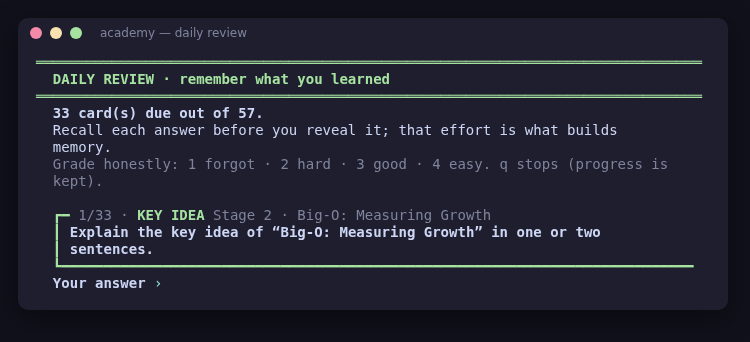
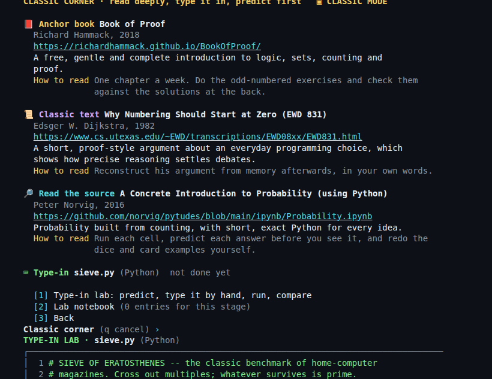
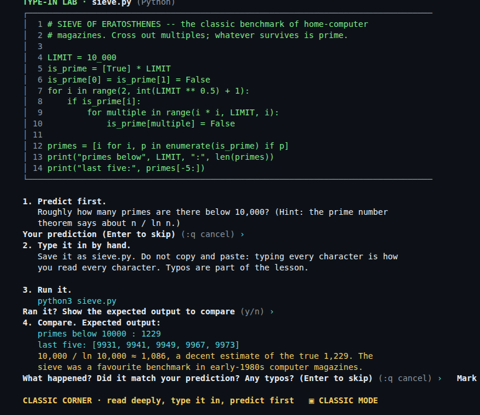
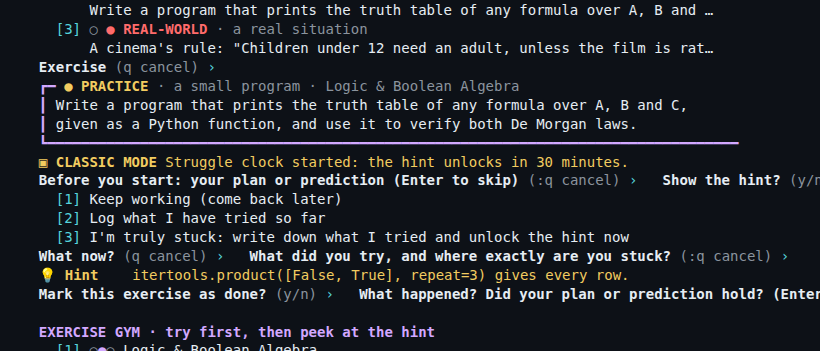
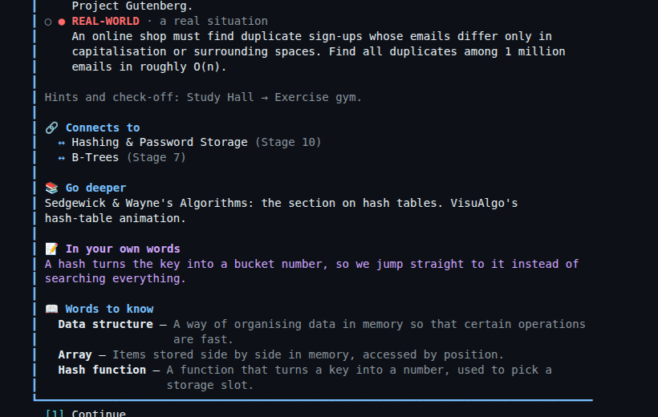
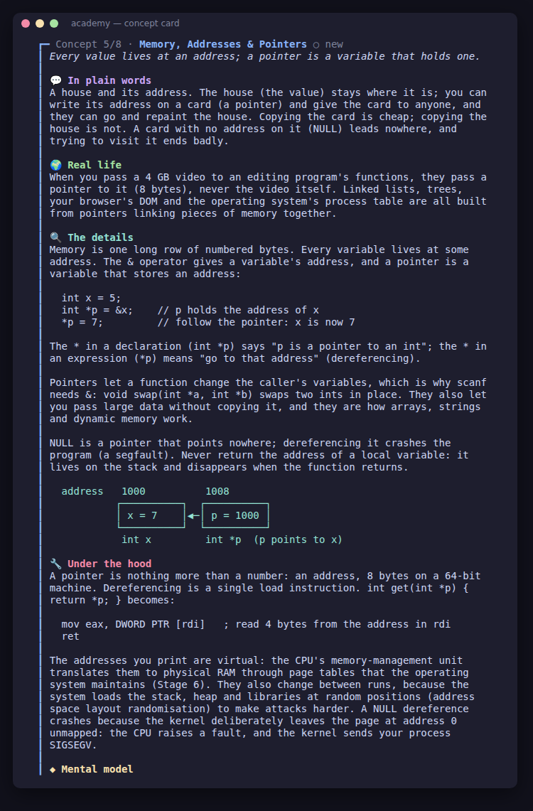
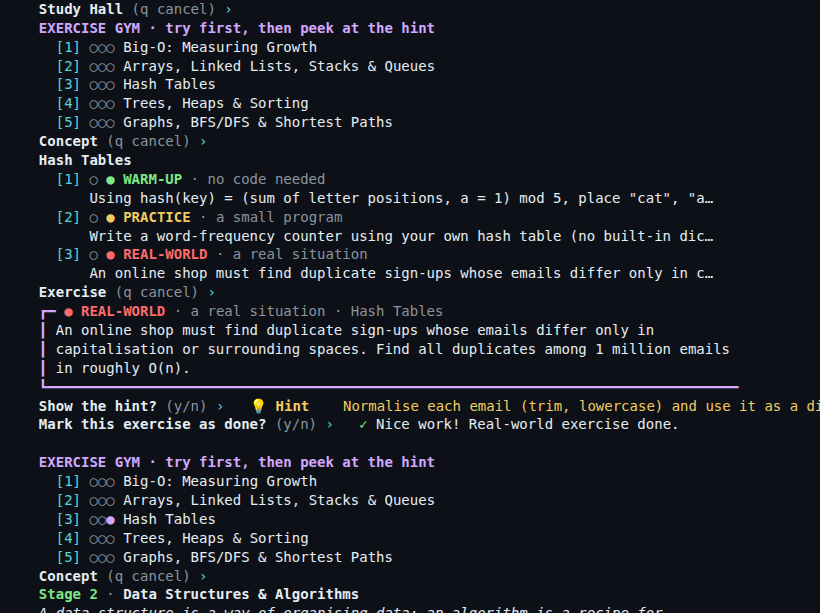
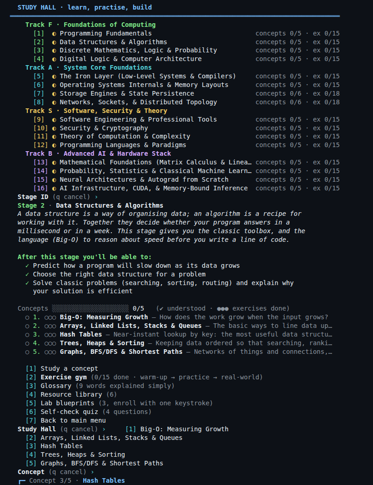
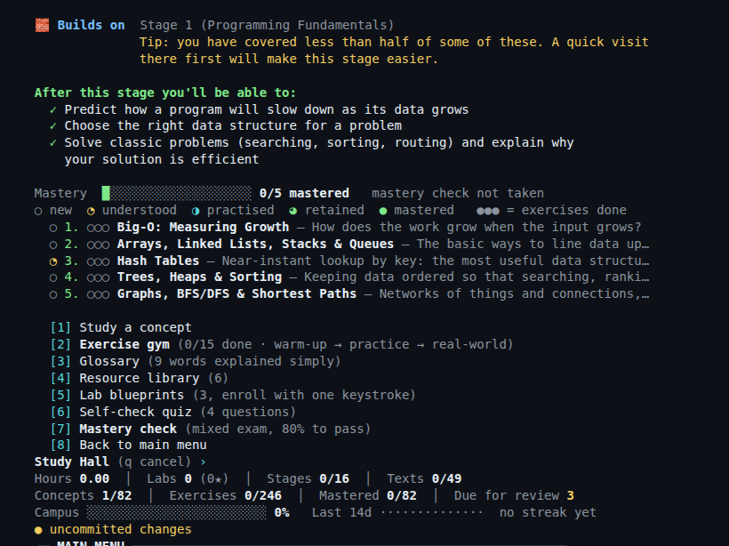
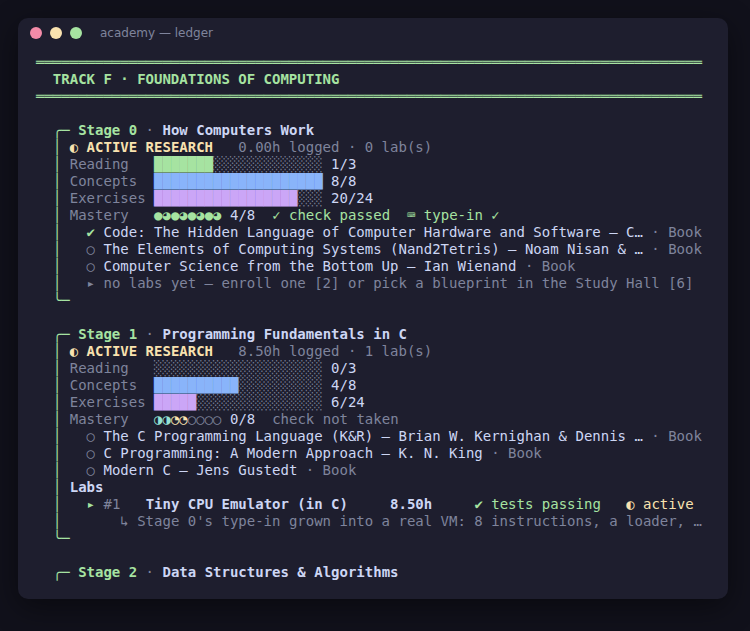

# Systems & AI Academy: Campus Registry

A terminal-based study companion for **self-learners**. It covers the core of a computer science degree plus modern AI in **16 stages**, and it assumes no prior knowledge. Every concept is explained from scratch and comes with **real-world exercises**.

It is written in Go, uses only the standard library, and keeps all your progress in one readable JSON file.

New here? Run the app and press **`0`** for the *Start Here* guide.

## The curriculum

| Track | Stage | Topic |
|-------|-------|-------|
| **F · Foundations** | 1 | Programming Fundamentals |
| | 2 | Data Structures & Algorithms |
| | 3 | Discrete Mathematics, Logic & Probability |
| | 4 | Digital Logic & Computer Architecture |
| **A · Systems** | 5 | The Iron Layer: compilers & the machine |
| | 6 | Operating Systems Internals & Memory |
| | 7 | Storage Engines, Databases & SQL |
| | 8 | Networks, the Web & Distributed Systems |
| **S · Software, Security & Theory** | 9 | Software Engineering & Professional Tools |
| | 10 | Security & Cryptography |
| | 11 | Theory of Computation & Complexity |
| | 12 | Programming Languages & Paradigms |
| **B · AI** | 13 | Mathematical Foundations: linear algebra & matrix calculus |
| | 14 | Probability, Statistics & Classical ML |
| | 15 | Neural Networks & Autograd from Scratch |
| | 16 | AI Infrastructure, CUDA & Inference |

That is **82 concepts** and **246 exercises**, plus a glossary, a resource library, lab blueprints, a quiz and a mastery check for every stage. Start Here also lists electives for afterwards: graphics, quantum computing, embedded systems and bioinformatics.

## Built to be remembered, not just read

Reading something once is not learning it. The academy builds in five techniques that research on memory consistently supports:

| Technique | How the academy uses it |
|-----------|-------------------------|
| **Retrieval practice** | **Daily Review** (menu `9`) asks questions instead of showing answers. You try to answer, reveal, then grade yourself: forgot / hard / good / easy. |
| **Spaced repetition** | Each card is rescheduled with an SM-2 style algorithm: 1 day, then 3 days, then roughly a week, then weeks and months. Forgotten cards return in the same session and restart their interval. |
| **Interleaving** | Reviews and mastery checks shuffle cards across concepts and stages. |
| **Your own words** (the Feynman technique) | Marking a concept as understood asks you to explain it in your own words. Your explanation is shown back to you on the concept card and next to its key-idea review card. |
| **Elaboration & connections** | Every concept links to related concepts in other stages, and every stage shows what it builds on. |

Each understood concept adds **three review cards** to your deck: its key idea, a real-life example, and its warm-up exercise. Once half of a stage's concepts are understood, the stage's quiz questions join the deck too. All answers come straight from the curriculum.

**The mastery ladder:** each concept climbs ○ new → ◔ understood → ◑ practised (2 exercises) → ◕ retained (every card remembered at a spacing of 7+ days) → ● **mastered** (all 3 exercises done, and every card remembered at a spacing of 21+ days). "Mastered" cannot be reached in a single day; it measures what you still know weeks later. Campus progress is weighted by mastery.

**The Mastery Check:** each stage has a 12-question interleaved exam drawn from all of its cards, and you pass at 80%. The result is recorded, and graduating a stage warns you if you have not passed it.



## Classic Mode: learn like it's 1985

Press **`c`** on the main menu. Classic Mode brings back the habits that made strong 1980s and 1990s learners so effective, and keeps modern help for when it is truly needed:

- **The struggle clock:** an exercise's hint stays locked for 10 min (warm-up), 30 min (practice) or 45 min (real-world) after you first open it. If you are truly stuck, you write down what you tried and where you are stuck, and the hint unlocks early. Describing the problem often solves it.
- **The lab notebook:** before an exercise you record a plan or prediction; afterwards, what actually happened. Entries are saved (`notebook`) and shown per exercise and per stage.
- **A classic corner in every Study Hall:**
  - **📕 Anchor book:** one book to read cover to cover, free wherever possible (HtDP, Erickson, Book of Proof, *Code*, CS:APP, OSTEP, DDIA, HPBN, Crafting Interpreters, MML, ISL…).
  - **📜 Classic text:** the field's history in the original, e.g. Dijkstra 1959 and 1968, von Neumann's EDVAC report (1945), Ritchie & Thompson's UNIX paper, Codd 1970, Thompson's *Trusting Trust*, Saltzer–Reed–Clark, Brooks's *No Silver Bullet*, *Smashing the Stack*, McCarthy's Lisp paper, Goldberg on floating point, LeNet (1998), and Wulf & McKee's *Memory Wall*.
  - **🔎 Read the source:** real, small codebases, such as Norvig's spelling corrector, algs4, Visual 6502, chibicc, xv6, SQLite, Redis's event loop, **Git's very first commit**, Juice Shop, Pike's regex matcher, lispy, micrograd and llm.c.
- **The type-in lab:** every stage has a short magazine-style listing, such as Collatz, the sieve, a ripple-carry adder built from gates, `fork(); fork();`, SQL injection, a regex matcher, a Lisp or a micro-autograd. You predict the output, type it in by hand (never paste), run it, then compare with the real output.





**Every type-in is tested:** the listings live in [`typeins/`](typeins/), and `typeins.go` is *generated* by running them (`python3 typeins/gen.py && gofmt -w typeins.go`). So the code on screen is exactly the code that was run, and every "expected output" is real output. Every classic-corner link was confirmed against live web search results.



## Accurate resources

- **Verified links:** every resource link was reviewed on 2026-09-24. The less-established URLs were confirmed against live web search results. That review corrected several links: Book of Proof moved to the author's GitHub Pages site; MIT 6.1810 now points to its permanent OCW archive; OWASP now points to the 2025 edition; Drepper's paper, Hughes' paper and 3Blue1Brown now point to their canonical hosts; and two links became more precise deep links.
- **Go deeper:** every concept has a pointer to *exactly* where to continue in its stage's resources, such as "CS:APP chapter 6 (The Memory Hierarchy)", "Nand2Tetris project 3" or "OSTEP: the chapters on paging and TLBs". Pointers name chapters and lectures by title, not guessed page numbers.
- **Re-check any time:** links move, so run `./academy -check-links` on any machine with internet access. It checks every URL concurrently (HEAD, falling back to GET) and exits non-zero if any fail.



## How each concept is taught

Each concept moves from intuition to precision:

1. **💬 In plain words:** an everyday analogy with no jargon.
2. **🌍 Real life:** where you have already met the idea, such as the Ariane 5 overflow, GTA Online's quadratic loading screen, Kubernetes running on Raft, or the CrowdStrike outage.
3. **🔍 The details:** the precise technical explanation, with a diagram where one helps.
4. **◆ Mental model:** one sentence to remember.
5. **🏋 Exercises:** three per concept, from easy to real-world (see below).
6. **🔗 Connects to / 📚 Go deeper:** related concepts in other stages, and exactly where to read next.
7. **📝 In your own words:** your explanation, once you have written it.
8. **📖 Words to know:** any jargon in the card is defined automatically at the bottom.



## Exercises

Every concept has a ladder of three exercises, and each exercise has a hint:

| Level | What it is | Example (Hash Tables) |
|-------|------------|------------------------|
| ● **Warm-up** | Pen and paper; no code needed | Hash "cat", "act" and "dog" into 5 buckets by hand; why do two of them collide? |
| ● **Practice** | A small program | Build a word counter on your own hash table and race it against the built-in one on a full book |
| ● **Real-world** | A task from a real situation | Find duplicate sign-ups among 1 million shop accounts in roughly O(n) |

The **Exercise Gym** in each stage's Study Hall shows the exercises, reveals hints only when you ask, and lets you tick exercises off. Your progress is saved (`exercises_done`) and shown in the ledger, and it counts towards overall campus progress.



## Build

```sh
cd academy
go build -trimpath -ldflags="-s -w" -o academy .      # Linux / macOS
go build -trimpath -ldflags="-s -w" -o academy.exe .  # Windows
./academy
```

Requires Go 1.22+. Nothing is downloaded, because there are no dependencies.

On first run, the program creates `academy_campus_registry.json` next to the binary. To put the file somewhere else, pass `-registry path/to/file.json`. (With `go run .`, the file goes in the current directory, because the temporary build directory would be deleted.)

Other flags: `-no-color`, `-check-links` (verify every resource URL), `-backups` (list automatic backups) and `-restore N` (restore one).

**Upgrading from the 7-stage version:** your existing registry file is migrated automatically. The original stages move to their new numbers (1→5, 2→6, 3→7, 4→8, 5→13, 6→15, 7→16), your labs, hours, readings and concept progress are kept, and the nine new stages are added. Commit once to save the upgraded file.

## Menu

| # | Action |
|---|--------|
| 0 | **Start Here**: what the academy covers, how memory works, how to practise, where to begin and a study rhythm |
| 9 | **Daily Review**: your due spaced-repetition cards, interleaved across stages (`r` works too) |
| n | **What's next**: up to four recommended steps (due reviews, next concept, an open exercise, a ready mastery check or type-in, a focus session) and one key to start any of them |
| / | **Search** (also `s`): every concept, glossary term, resource, blueprint and classic; all words must match, titles rank first; open a hit directly |
| f | **Focus timer**: a live countdown (`p` pause, `s` stop, bell when done) logged as a study session under a stage |
| p | **Progress report**: a GitHub-style activity calendar, the last 7 days against the 7 before, time and mastery per track, deck health and your most-forgotten cards |
| x | **Export notes**: writes `academy_notes.md` next to the registry with your progress, own-words explanations, notebook and labs |
| m | **Roadmap**: all 16 stages by track, each marked locked · ready · in progress · understood · mastered, with concept progress, "you are here", and which stages a locked one still needs; open any stage's Study Hall from it |
| g | **Weekly goals**: study minutes, study days and review cards per week (Monday to Sunday), tracked on the dashboard: cyan on track, yellow behind, green done |
| a | **Achievements**: 20 milestones (first concept, 7- and 30-day streaks, 100 and 1,000 reviews, a mastered concept, a passed mastery check, a whole track, graduation…), announced the moment you earn them |
| c | **Classic Mode** on/off: struggle clock, lab notebook, classic corners and type-ins |
| t | **Tidy screen** on/off: every action starts on a clean screen |
| ? | **Keys & shortcuts** (also `h` or `help`) · `clear` / `cls` clears the screen |
| 1 | **View Campus Ledger**: a colour card per stage, with reading, concept and exercise progress bars, labs and hours |
| 2 | **Enroll in a New Lab**: pick a track (`F`/`A`/`S`/`B`), a stage, then a name, notes and initial hours |
| 3 | **Log Study/Lab Hours**: add hours (`1.5`, `1h30m`, `45m`) with an optional note |
| 4 | **Advance Academic Status**: graduate stages or labs, mark literature as read, set compilation status |
| 5 | **Atomic Commit & Exit** |
| 6 | **Study Hall**: concepts, exercise gym, glossary, resources, lab blueprints, quiz and mastery check |
| 7 | Checkpoint: commit and keep working |
| 8 | Exit without saving (asks for confirmation) |

Above the menu, a dashboard shows hours, labs, stages, texts, concepts, exercises, **mastered concepts** and **cards due for review**, plus mastery-weighted campus progress, a 14-day activity sparkline, and a study streak (logged hours, focus sessions and review days all count). If you have set weekly goals, a **This week** line tracks them. Below it, a **➜ Next** line names your best next step; press `n` to start it.

Long screens (the ledger, Start Here, glossaries, resources, concept cards, the notebook) are shown one terminal page at a time: press **Enter** for the next page or **q** to return to the menu. Paging switches on only when you are typing at a real terminal (it uses `$LINES` if set, else 24 rows); piped or scripted input is unaffected.

To cancel a prompt, type `q` at number prompts or `:q` at text prompts. Ctrl-D and Ctrl-C/SIGTERM also commit before exiting.



## Keyboard

| Key | Where | Does |
|-----|-------|------|
| **Ctrl+L** | any prompt | clears the screen and redraws it (the main menu is redrawn too), keeping what you have typed |
| Backspace | any prompt | deletes the previous character |
| Ctrl+U / Ctrl+W | any prompt | erases the whole line / the previous word |
| Ctrl+D | empty prompt | ends input: commits your work and exits |
| Ctrl+C | anywhere | commits your work and exits |
| Enter / q | long screens | next page / back to the menu |

On Linux, macOS and the BSDs, the academy reads keys one at a time (a small built-in line editor using termios from Go's standard library), so Ctrl+L works instantly and arrow keys are ignored instead of printing `^[[A`. The terminal is always restored on exit, including after Ctrl+C. Elsewhere (for example Windows), input stays line-based: press **Ctrl+L then Enter**, or type `clear`.

## Resizing the terminal

The layout follows your terminal's **live size**. It reads the size with an ioctl on Linux, macOS and the BSDs, and asks the console on Windows, falling back to `$COLUMNS`/`$LINES`.

- **At the main menu the screen redraws itself as soon as you resize.** It keeps anything you have half-typed, and a whole burst of resize events while you drag a window edge produces a single redraw. Every other screen fits the new size the next time it is drawn, or immediately when you press **Ctrl+L**.
- **Layouts adapt from 40 columns up:**
  - The menu switches between two columns and one, and drops hints first.
  - Dashboard stats flow onto more lines.
  - Stage cards shrink their bars.
  - Lab rows split into two lines.
  - Long titles are cut with `…`, and paths and URLs wrap.
  - Long questions wrap, with your input on the last line.
  - Pages use the real terminal height.
- **Content stays readable:** it stops widening at 110 columns.
- **Code and diagrams:** code listings wrap long lines with a `↪` marker, so no code is ever hidden. ASCII diagrams are clipped with `…` and a note to widen the window.
- **Input that wraps across rows** is still erased and redrawn correctly by Backspace, Ctrl+U and Ctrl+W.
- **Checking it:** `tools/layout_check.py` drives every major screen through a real pseudo-terminal at any widths you give it and reports lines wider than the terminal. It currently finds none from 40 to 200 columns.

## Study Hall

For every stage:

- **Builds on:** the stages this one depends on, with a nudge if they are still thin.
- **What you'll be able to do:** concrete outcomes, shown before you begin.
- **Mastery overview:** a glyph per concept on the mastery ladder, and your mastery-check result.
- **Concepts:** the six-part cards described above. Mark each one as understood once you could explain it to a friend.
- **Exercise gym:** warm-up → practice → real-world, with hints and check-off.
- **Glossary:** 8–12 words explained simply.
- **Resource library:** free courses, books, papers, videos and tools with links, such as CS50, MIT OCW courses, OSTEP, CMU 15-445, PortSwigger Academy, ISL, and Karpathy's *Zero to Hero*.
- **Lab blueprints:** larger projects with milestones (a text adventure, a route planner, a CPU emulator, a password manager, a regex engine, Raft, GPT from scratch…). You can enroll any of them as a lab in one step.
- **Self-check quiz:** flashcards with self-scoring.
- **Mastery check:** a 12-question interleaved exam, passed at 80%.
- **Classic corner:** anchor book, classic text, real source code, the type-in lab and your lab notebook.

Concepts link across stages. For example, logic gates (Stage 4) become the CPU; the memory hierarchy (Stage 5) returns as the roofline model (Stage 16); and paging (Stage 6) returns as PagedAttention.





## Colours

Colour is turned on automatically when output goes to a terminal. It is turned off by `-no-color`, by setting `NO_COLOR`, by `TERM=dumb`, or when output is piped. Text follows the live terminal width (40–110 columns; `$COLUMNS` or 80 when it cannot be read).

## Tests

```sh
go test ./...
```

The tests check:
- **Curriculum integrity:** every seeded stage has a guide; every concept has an analogy, a real-life example and a warm-up → practice → real-world exercise ladder with hints; no orphaned explainer or exercise sets.
- **The v1 → v2 migration and stage merging.**
- **Retention:** the scheduler's intervals grow and reset on a lapse; deck unlocking and due cards; each step of the mastery ladder.
- **Classic Mode:** every stage has a complete classic corner with HTTPS links; the struggle clock's thresholds and early unlock; notebook and type-in progress survive a save round trip.
- **Connections:** globally unique concept names; every concept has valid cross-links and a go-deeper pointer; prerequisites only point backwards; every resource uses HTTPS.
- **Layout:** display widths (emoji, CJK and combining marks), wrap and flow never exceed the width, and long prompts wrap.
- **Guidance:** What's next ordering and its four-step limit, prerequisites, search AND semantics and ranking, snippets, daily minutes and the weekly comparison, focus sessions in stats, and the Markdown export.
- **Goals, roadmap and achievements:** the calendar week's minutes, days and cards; the on-track rule; each stage state and its missing prerequisites; achievements awarded exactly once; backups deduplicated, rotated to 10, restored, and bad backups refused without touching the registry.
- **Mechanics:** text wrapping, hour parsing, the atomic-write round trip and the activity streak.

## Source layout

One package, one build target:

| File | Contents |
|------|----------|
| `main.go` | schema, migration, storage layer (atomic write), entry point |
| `console.go` | sanitised, line-based input over `bufio` |
| `ui.go` | ANSI styling, progress bars, text wrapping, sparklines |
| `app.go` | dashboard, ledger and all ledger actions |
| `studyhall.go` | concept reader, exercise gym, glossary, resources, blueprints, quizzes, Start Here |
| `retention.go` | review cards, SM-2 style scheduler, mastery ladder |
| `review.go` | Daily Review and Mastery Check screens |
| `connections.go` | concept cross-links, go-deeper pointers, stage prerequisites |
| `linkcheck.go` | `-check-links` resource verifier |
| `lineedit.go` | key-by-key line editor: Ctrl+L, Backspace, Ctrl+U/W, ignores escape sequences |
| `term_*.go` | raw terminal mode via termios (Linux, macOS, BSD) and a line-mode fallback |
| `pager.go` | pages long screens on interactive terminals |
| `termsize_*.go`, `sigwinch_*.go` | live terminal size (ioctl / Windows console API) and resize notifications |
| `tools/layout_check.py` | overflow checker: renders every screen at chosen widths in a pseudo-terminal |
| `classic.go` | Classic Mode: classic corners, struggle clock, notebook |
| `classicui.go` | Classic Mode screens: toggle, classic corner, type-in lab, notebook |
| `insights.go` | What's next, search, study sessions, activity history, Markdown export |
| `insightsui.go` | screens for the above, including the live focus timer and progress report |
| `goals.go` | weekly goals, roadmap stage states, achievements, rotating backups and restore |
| `goalsui.go` | goals, roadmap and achievements screens |
| `typeins.go` | generated type-in listings with their real output (see `typeins/`) |
| `curriculum.go` | types, plus Tracks A and B (stages 5–8, 13, 15, 16) |
| `curriculum_foundations.go` | Track F (stages 1–4) |
| `curriculum_software.go` | Track S (stages 9–12) |
| `curriculum_data.go` | Stage 14 |
| `explainers.go` | analogies, real-life examples and glossaries for the original stages; Start Here |
| `exercises.go` | exercises for the original stages |

## Data safety

- **Atomic writes:** the program writes a temporary file in the same directory, fsyncs it, renames it over the registry, then fsyncs the directory. A crash leaves either the old file or the new one, never a half-written file.
- **Automatic backups:** before each commit, the previous registry is copied to `academy_backups/` beside it (identical copies are skipped, and the newest 10 are kept). `./academy -backups` lists them; `./academy -restore 2` (or `-restore path/to/file.json`) restores one after checking that it loads cleanly, and backs up the file it replaces first, so a restore can be undone the same way. Restore while the academy is closed.
- **Corrupt-file guard:** if the registry won't parse or fails validation, the program refuses to start rather than overwrite it.
- **Input rigor:** the program removes control characters, trims whitespace, and rejects input that is too long instead of cutting it off. It re-prompts when a number can't be parsed. Hours must be finite, non-negative, and at most 24 per log entry. Duplicate lab names within a stage are rejected, and so are unknown menu options.

## Schema (abridged)

```json
{
  "schema_version": 2,
  "last_commit": "2026-09-24T11:02:38Z",
  "next_lab_id": 2,
  "tracks": [{
    "id": "F", "name": "Foundations of Computing",
    "stages": [{
      "id": 2, "title": "Data Structures & Algorithms",
      "status": "Active Research",
      "required_literature": [{ "title": "The Algorithm Design Manual", "author": "Steven Skiena", "kind": "Book", "read": true }],
      "concepts_studied": ["Hash Tables"],
      "exercises_done": ["Hash Tables #1", "Hash Tables #3"],
      "notes": { "Hash Tables": "A hash turns the key into a bucket number, so we jump straight to it." },
      "mastery_check": { "taken_at": "2026-09-24T12:48:41Z", "score": 10, "total": 12, "passed": true },
      "labs": [{
        "id": 1, "name": "Route Planner",
        "architecture_notes": "Dijkstra and A* on an OpenStreetMap extract",
        "hours_logged": 4.75,
        "compilation_status": "Tests Passing",
        "status": "Mastered/Graduated",
        "enrolled_at": "2026-09-24T11:02:38Z",
        "hour_log": [{ "at": "2026-09-24T11:02:38Z", "hours": 1.5, "note": "initial hours" }]
      }]
    }]
  }],
  "reviews": {
    "Hash Tables :: key idea": { "due": "2026-09-27T00:00:00+02:00", "interval_days": 3, "ease": 2.5, "reps": 2, "lapses": 0, "last_reviewed": "2026-09-24T14:48:41+02:00" }
  },
  "review_history": { "2026-09-24": 4 },
  "goals": { "minutes": 150, "days": 5, "cards": 70 },
  "achievements": { "first-concept": "2026-09-24T11:05:00Z" },
  "study_sessions": [{ "start": "2026-09-24T14:00:00Z", "minutes": 25, "stage": 2, "note": "hash table exercise" }]
}
```

Review progress, notes and mastery checks are additive fields. Older files simply start with an empty deck.
